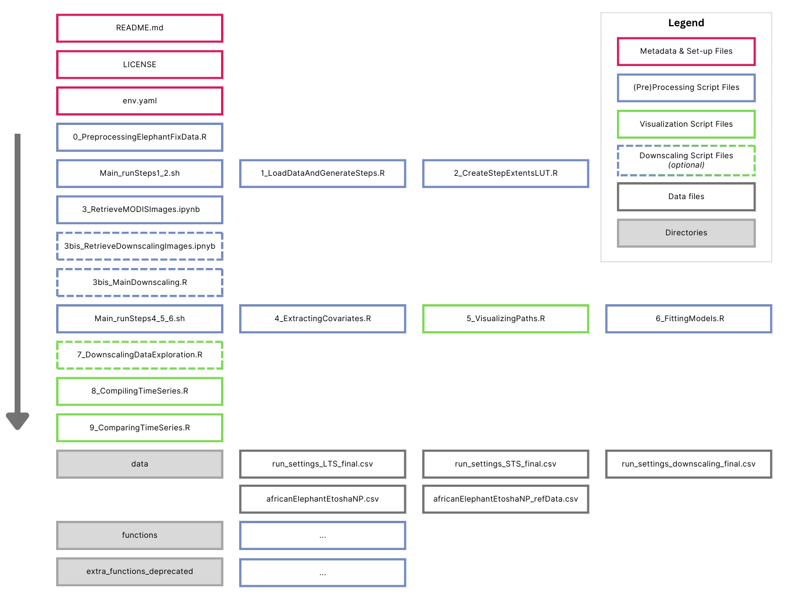

# Modelling Elephant Movement Response to Vegetation Change & Downscaling MODIS to 30m 

Author: Jacotte Monroe

Wageningen University & Research GRS MSc Thesis

\_\_\_\_\_\_\_\_\_\_\_\_\_\_\_\_\_\_\_\_\_\_\_\_\_\_\_\_\_\_\_\_\_\_\_\_\_\_\_\_\_\_\_\_\_\_\_\_\_\_\_\_\_\_\_\_\_\_\_\_\_\_\_\_\_\_\_\_\_\_\_\_\_\_\_\_\_\_\_\_\_\_\_\_\_\_\_\_\_\_\_\_\_

## Project Description

This collection of scripts compiles all the work done in the [MSc thesis](https://www.wur.nl/en/activity/navigating-change-elephant-movement-response-to-vegetation-dynamics-in-etosha-national-park-namibia.htm) to better understand how elephants in Etosha responded to weekly vegetation dynamics. To do so, the elephant data was first pre-processed and transformed from GPS fixes to movement steps. The project also retrieves MODIS NDVI scenes to match with the elephant movement and fits weekly logistic regressions to capture the relation between vegetation metrics and elephant occurrence. This is by default done using MODIS NDVI at 250 m.

The project is taken a step further, adding an intermediate step to downscale the MODIS images by fusing it with Landsat 8 30 m data. Logistic regressions are then fitted through the elephant movement data and the MODIS NDVI 30 m data to capture the elephant response to vegetation dynamics with a 30 m spatial resolution.

The model results and performance metrics are then compiled in three ways:

1.  A short time-series over six months, but including data from 13 elephants;

2.  A long time-series over five years, including data from five elephants;

3.   Comparative graph of three weeks of data, from two elephants, using MODIS NDVI 250 m vs MODIS NDVI 30 m.

\_\_\_\_\_\_\_\_\_\_\_\_\_\_\_\_\_\_\_\_\_\_\_\_\_\_\_\_\_\_\_\_\_\_\_\_\_\_\_\_\_\_\_\_\_\_\_\_\_\_\_\_\_\_\_\_\_\_\_\_\_\_\_\_\_\_\_\_\_\_\_\_\_\_\_\_\_\_\_\_\_\_\_\_\_\_\_\_\_\_\_\_\_

## Project Structure 

The repository contains some preliminary logistics files, such as a license, this README file, and a yaml file to set up the proper environment (see [Installation]). More importantly, the scripts used to process and analyze the data are numbered chronologically by step of the project, starting with elephant data pre-processing and ending with some scripts to visualize the modeled response as time-series. Steps 1 and 2 can be automated for each iteration (weekly elephant data) by running the *Main_runSteps1_2.sh* bash script. Similarly *Main_runSteps4_5_6.sh* iterates through the run table, automatically running steps 4, 5, and 6 for each week of elephant data. A full run table of all elephant datasets can be compiled by running *0_PreprocessingElephantFixData.R.* However, the exact run tables are provided in the *run_tables* directory to generate the short time-series, long time-series, and downscaled models. The scripts corresponding to downscaling are distinguished, in Figure 1, as dashed, as they are optional steps to run in the process. Each (pre)processing script is structured with a heading describing the purpose of the script. Finally, the functions corresponding to the scripts can be found in the *functions* directory. The *extra_functions_deprecated* directory can be ignored, as none of the functions are necessary to run the script (they are a trace of historical attempts that I wish to keep).



*Figure 1: Project structure diagram.*

\_\_\_\_\_\_\_\_\_\_\_\_\_\_\_\_\_\_\_\_\_\_\_\_\_\_\_\_\_\_\_\_\_\_\_\_\_\_\_\_\_\_\_\_\_\_\_\_\_\_\_\_\_\_\_\_\_\_\_\_\_\_\_\_\_\_\_\_\_\_\_\_\_\_\_\_\_\_\_\_\_\_\_\_\_\_\_\_\_\_\_\_\_

## Installation

1.  Clone this git repository

2.  In the terminal, make sure to be in the correct path. This is necessary for be setting up the environment (and running the Google Earth Engine (GEE) Python API for satellite data retrieval). *Note: The following instructions only support the project set-up using mamba as the package manager.*

3.  Create a new environment to manage the various packages that will be used in this project.

    ``` bash
    mamba env create --file env.yaml
    ```

4.  Once created, activate the environment.

    ``` bash
    source activate MSc_Thesis
    ```

5.  Open jupyter lab for first-time identification. *Note: A Google account is necessary to access GEE.*

    ``` bash
    jupyter lab
    ```

6.  Jupyter lab will open in your search engine. From there you can open open either *ipynb* file and try to run it. A pop-up pane should open asking for authentication. Follow the steps for first-time authentication. If you get an error instead of the authentication pane, please comment out the script temporarily to only have the *ee.Authenticate* command. *Note: This authentication is a one-time action and can be done later in the process when it comes time to retrieve images.*

\_\_\_\_\_\_\_\_\_\_\_\_\_\_\_\_\_\_\_\_\_\_\_\_\_\_\_\_\_\_\_\_\_\_\_\_\_\_\_\_\_\_\_\_\_\_\_\_\_\_\_\_\_\_\_\_\_\_\_\_\_\_\_\_\_\_\_\_\_\_\_\_\_\_\_\_\_\_\_\_\_\_\_\_\_\_\_\_\_\_\_\_\_

## How to Use

1.  First, check that the environment has been set up and that it is activated.

2.  The elephant data is provided in the *data* folder or can be manually retrieved from Movebank (see [Data Sources]). Check that the file is named *africanElephantEtoshaNP.csv* and located in a *data* directory. The metadata can be found in the file *africanElephantEtoshaNP_referenceData.csv.*

3.  You can now run the pre-processing script (step 0) *0_PreprocessingElephantFixData.R* in RStudio. This will clean the raw data and generate different datasets for each elephant. One of the outputs is a run table for running each week of elephant data. The *data* folder also contains the exact run tables of the datasets that were run in the thesis (as some weeks were omitted due to insufficient data).

4.  We now want to transform the elephant fixes into movement data for each week of elephant data. This can be done by running manually step 1 and 2 scripts or automating the process by running *main_runSteps1_2.sh* in the terminal. *Note: You may need to give permission for the file to be read.*

    ``` bash
    # to change permissions
    chmod u+x main_runSteps1_2.sh
    ```

    ``` bash
    # to run script
    ./main_runSteps1_2.sh
    ```

5.  Open jupyter lab in the terminal to retrieve the satellite images. This must be done after step 2 and before step 4. Either retrieve the default MODIS 250 m scenes or run the *3bis* script to retrieve Landsat 8 images as well as MODIS 250 m.

6.  (Optional) *3bis_MainDownscaling.R* must be run after retrieving Landsat and MODIS scenes to create MODIS 30 m images.

7.  Run *main_runSteps4_5_6.sh* in the terminal to extract the vegetation metrics, visualize the paths, and fit the models for each week of elephant data.

8.  Steps 7-9 summarize all models into time-series and plot model performance.

\_\_\_\_\_\_\_\_\_\_\_\_\_\_\_\_\_\_\_\_\_\_\_\_\_\_\_\_\_\_\_\_\_\_\_\_\_\_\_\_\_\_\_\_\_\_\_\_\_\_\_\_\_\_\_\_\_\_\_\_\_\_\_\_\_\_\_\_\_\_\_\_\_\_\_\_\_\_\_\_\_\_\_\_\_\_\_\_\_\_\_\_\_

## Data Sources 

All MODIS, Landsat 8, and ECMWF data used in this project was directly (automatically or manually) retrieved from Google Earth Engine:

-   [MODIS Terra Surface Reflectance Daily 250 m](https://developers.google.com/earth-engine/datasets/catalog/MODIS_061_MOD09GQ);

-   [Landsat 8 Level 2 30 m](https://developers.google.com/earth-engine/datasets/catalog/LANDSAT_LC08_C02_T1_L2);

-   [ECMWF ERA5 Land Daily Accumulated Precipitation 11.1 km](https://developers.google.com/earth-engine/datasets/catalog/ECMWF_ERA5_LAND_DAILY_AGGR).

Elephant GPS tracking dataset was collected by [Tsalyuk et al. (2018)](https://esajournals.onlinelibrary.wiley.com/doi/abs/10.1002/ecm.1348) and retrieved on [Movebank](https://www.movebank.org/movebank/#page=studies,path=study605129389).

\_\_\_\_\_\_\_\_\_\_\_\_\_\_\_\_\_\_\_\_\_\_\_\_\_\_\_\_\_\_\_\_\_\_\_\_\_\_\_\_\_\_\_\_\_\_\_\_\_\_\_\_\_\_\_\_\_\_\_\_\_\_\_\_\_\_\_\_\_\_\_\_\_\_\_\_\_\_\_\_\_\_\_\_\_\_\_\_\_\_\_\_\_

## References 

Tsalyuk, M., Kilian, W., Reineking, B., & Getz, W. M. (2019). Temporal variation in resource
selection of African elephants follows long‐term variability in resource availability. Ecological
Monographs, 89(2). <https://doi.org/10.1002/ecm.1348>
